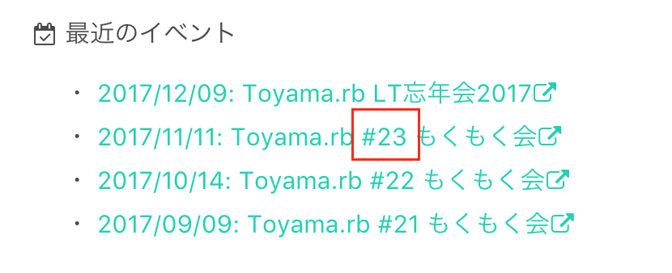
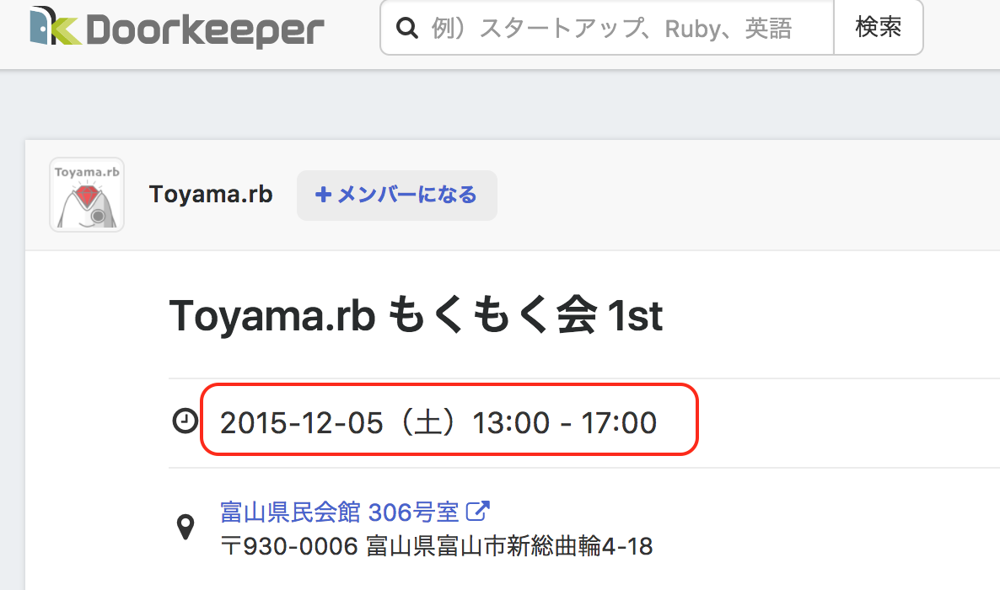
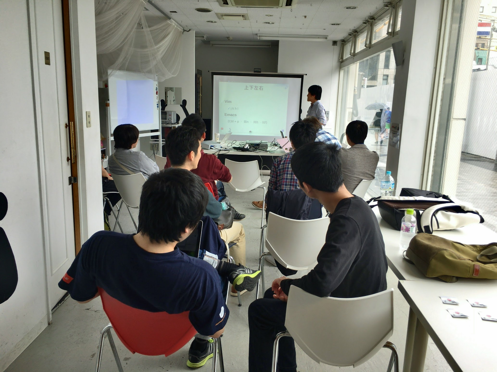
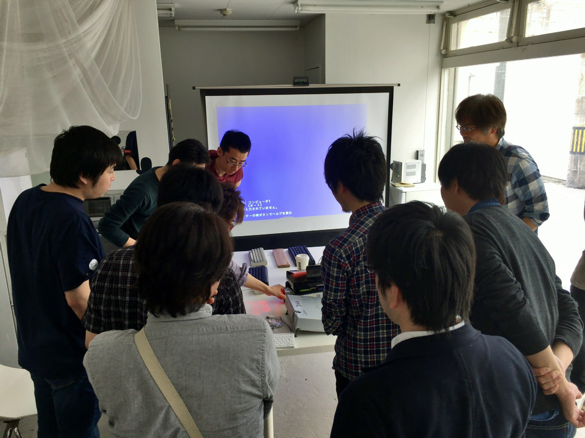
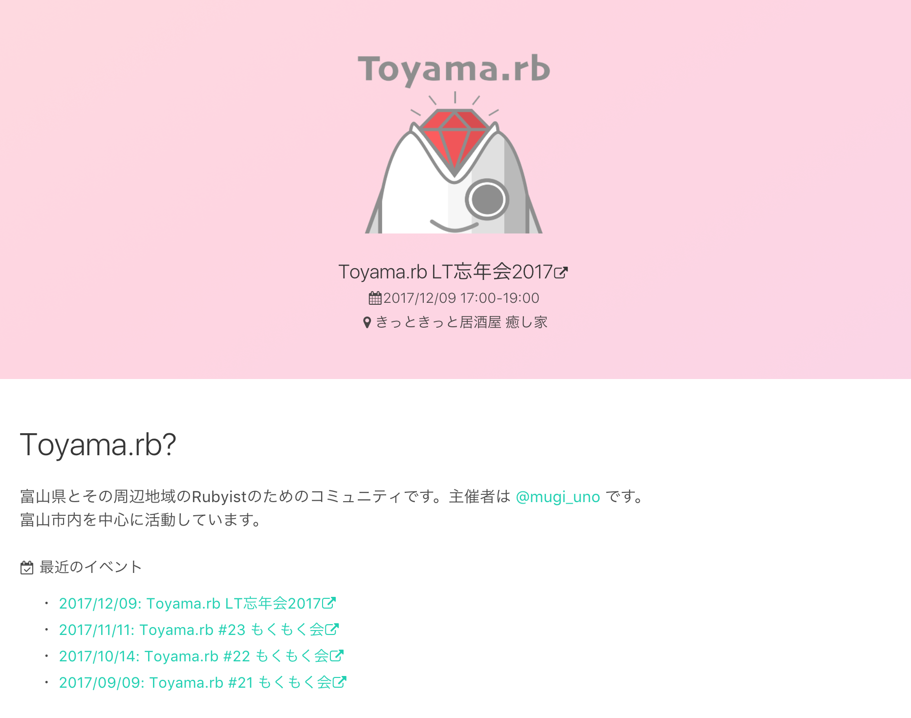
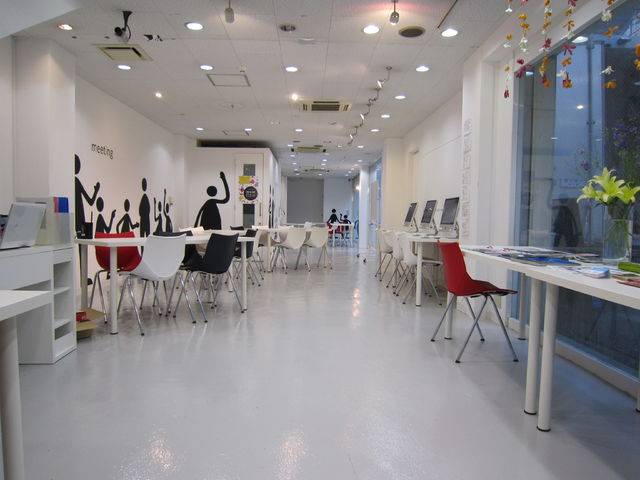
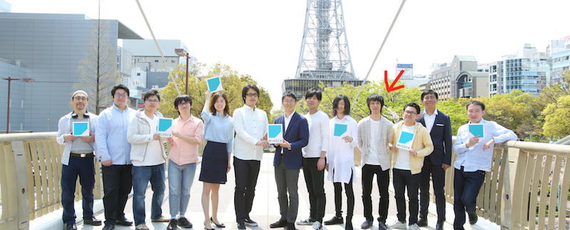
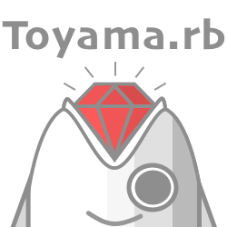
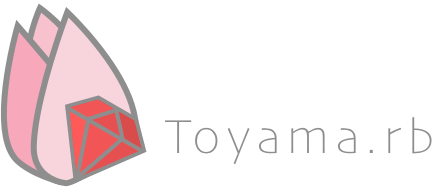

Toyama.rb LT忘年会2017

2017/12/09

---

回数で言うと、#24にあたります

---

第1回目の開催

---

つまり...

---

祝 🎉 2年

---

# Toyama.rb  
# 2周年ふりかえり

---

## 2017年をふりかえる

---

2017/05/13
エディタについて語ろう会

---

14名が参加してくれました

---

---

---

2017/08/12
フロントエンド勉強会

---

モブプログラミングをやってみた

---

成果物

---

Toyama.rbのホームページにReactを導入

https://toyamarb.github.io/

---

その他のイベント

---

- もくもく会
- もくもく会
- もくもく会
- ...

---

## 2016年と変わったこと

---

#### 1. 会場

---

MAG.netさんを使えるようになりました

---

結果 : 参加費0円になった

---

MAG.netさんマジ感謝やで...

(菓子折でも持っていきたい)

---

#### 2. リモートワーカーが増えた

---

とりあえず私がリモートワーカーになった

---

リモートワークのコミュニティではない

---

（これって結構すごいことなのでは...?）

---

活かせるイベントとかやれたらいいな〜

---

#### 3. ロゴができた

---

こっちはまるで使っていない

---

## KPT

---

### Keep

---

#### 毎月開催できた！

---

皆さんのおかげです！

---

#### ホームページができた！

---

勉強会の題材とかにも使えて便利

---

### Problem

---

#### イベントが2回しかできなかった

---

Toyama.rb以外のイベントに  
パワーを使った感がある

- TDDBC
- Agile Japan 富山サテライト

---

#### Ruby書いてない

---

書こうな！（自戒）

---

### Try

---

#### 手を動かすイベントの開催頻度を上げたい

---

アイデア募集中

---

というわけで

---

皆さん今年一年ありがとうございました！

---

来年も気が向いたら参加してください！

---

#### あとRuby書こうな！！

---

カンパーイ 🍻

---

〜終〜