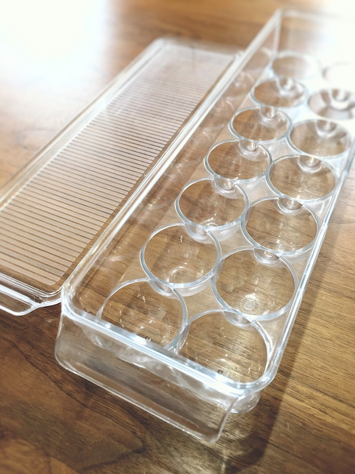
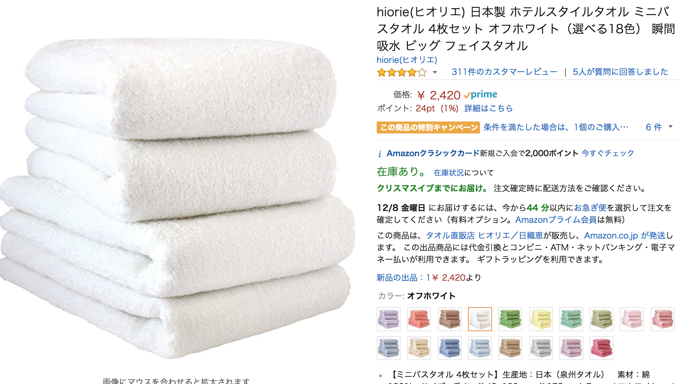
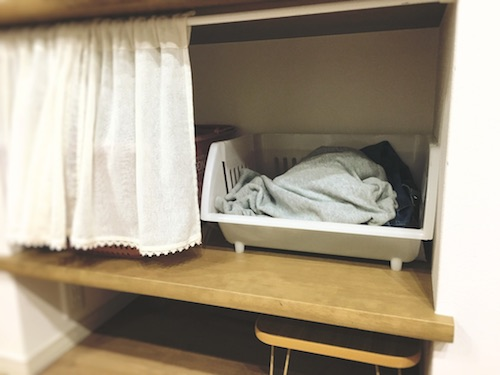

2017/12/09 Toyama.rb LT忘年会2017

---

質問

---

Q. 家、片付いていますか？

---

我が家はキレイです（たぶん）

---

Q. 家の中で楽できてますか？

---

我が家はいろいろと楽です

---

#### 理由

---

「妻がこだわっている」

---

話を聞くと
「なるほど〜」
ということがたくさん

---

というわけで

---

# 妻から学ぶ
# ライフハック

---

presented by 妻

---

#### Q. 何のために整理収納するのか？

---

#### A. 「楽するため」

---

「キレイに見せること」  
が目的ではない

---

日常で繰り返し行うことを簡単に

---

→ ゆとりが生まれる

---

### 我が家での工夫

---

#### ゴミ箱

---

ゴミ捨てを楽にする

---

ポイント

---

ゴミ箱にゴミ袋をかぶせる

---?image=assets/gomi1.JPG&size=auto 75%

---

袋ごとポイすれば終わる

---

ここまではやってる人もいるかも

---

さらに

---

Q. ゴミ袋はどこにしまう？

---

A. ゴミ箱の中

---

1. 大きいゴミ袋に小さいゴミ袋ごとポイ
2. 底にゴミ袋のストックがある
3. 1枚とってかぶせる

---

ゴミ捨てが少し楽に！

---

#### 卵

---

Q. 卵を買ったらどこにしまう？

---

普通 : 冷蔵庫のポケット

---

こんなのが付属されてる

---

卵は1パック10個

---

冷蔵庫のポケットも10個

---

ピッタリ！

---

→NO!

---

次に卵を買うのは 
「卵が少なくなった」タイミング

---

→10+αが最大数

---

結果起きること

- とりあえず上に積む
- 突然の卵たっぷりオムライス

---

解決策 : こういうのを買う

---

14個入るので解決

---

#### ティッシュ

---

Q. ティッシュの箱はどこに置くといいか？

---

A. いろんなところに置く

---

= 1箱ではない

---

「ちょっとティッシュとって〜！」 
って言ってませんか？

---

その場所は本来置くべき場所

---

使う場所には全部置いてしまえ！

---

リビングの中央

---

ソファーの横（引き出しに隠してる）

---

キッチン

---

洗面所

---

「ティッシュとって〜！」を滅ぼす

---

#### タオル

---

当然のように使うもの

- 洗顔時のフェイスタオル
- お風呂上がりのバスタオル

---

本当に「当然」かどうか

---

我が家で使っているもの

- ハンドタオル
- ビッグフェイスタオル

---

洗顔時

フェイスタオル 
↓ 
ハンドタオル

---

顔を拭くだけならハンドタオルで充分

---

お風呂上がり

バスタオル 
↓ 
ビッグフェイスタオル

---

ビッグフェイスタオル？

---

= 半分ほどの大きさのバスタオル

---

Amazonとかでも買える

---

半分あれば全然問題ない

---

メリット

- 洗濯が圧倒的に楽になる
- 洗濯乾燥で一撃
- ちゃんと洗濯できて清潔

---

デメリット

- 大きいタオルの爽快感はなくなる
- 大きいふわふわのバスタオルはきもちいい

---

#### 菜箸

---

料理の取り分け時に使ったりする

---

菜箸で楽するコツ

---

色や柄を同じもので揃える

---

---

適当に2本取る 
↓ 
1膳になる!

---

#### DMZを作る

---

家のすべてを整理するのは大変

---

郵便物とかダイニングテーブルに置きがち

---

部屋着やパジャマそのへんに放置しがち

---

どうするか？

---

A. 家の中にDMZをつくる

---

DMZ = 非武装地帯

---

「ここは散らかしていい！」
というエリアを作っておく

---

我が家のDMZ

---

部屋着とかはここにぶち込んでいい

---

見えてないけど、上の段にも 
カバンや郵便物を放り投げておいてok

---

全部キレイにしておくのは大変

---

緩衝材になるエリアがあると楽になる

---

## 基本的な考え方

---

#### 使う場所の近くに置く

---

無駄な行き来をなくす

---

生活のstep数を減らす

---

手間が減ると楽になる

---

#### 捨てる

---

たとえばボールペン

---

普段使っている２〜３本を選ぶ

---

後は全部捨てる

---

大量にあると、 
"選ぶ"必要がある

---

モノが多いことで迷いが生じる

---

少なければ選ばなくていい

---

たとえば冷蔵庫備え付けの卵ポケット

---

使わないなら捨てる  
（捨てました）

---

「いつか使うかも...」

---

→永遠に来ない

---

「万が一使うときが来たら？」

---

→そのときに考えればいい

---

妻いわく  
「モノが多いのは乏しいこと」

---

#### モノの帰る場所を決めておく

---

全てのモノに帰る場所を用意する

---

使うときに 
"探す"手間がなくなる

---

片付けるときに 
どこにしまう？といった 
"考える"手間がなくなる

---

## まとめ

---

整理収納は 
「美しさ」ではなく 
「使いやすさ」が重要

---

キレイな整理収納を求めて 
家族がストレスに感じたら価値は無い

---

ラクに生きましょう！

---

〜終〜
